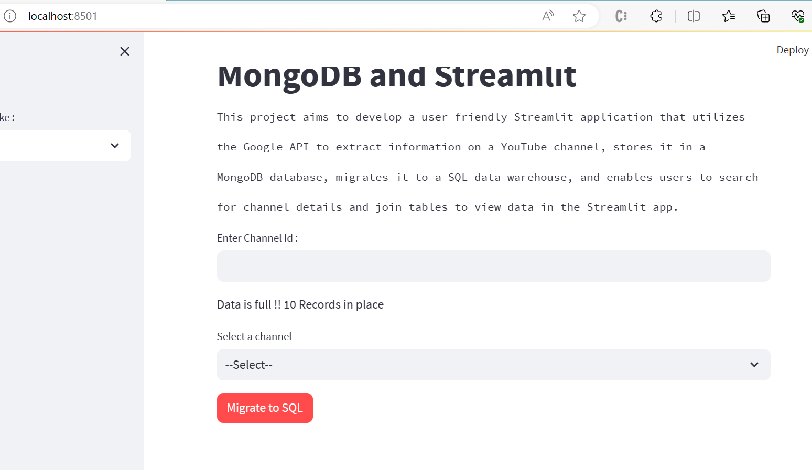

# Youtube-Data-Harvesting

## **About of the Project :**

This project aims to develop a user-friendly Streamlit application that utilizes the Google API to extract information on a YouTube channel.

**Problem Statement:**

The problem statement is to create a Streamlit application that allows users to access and analyze data from multiple YouTube channels. The application should have the following features:

1. Ability to input a YouTube channel ID and retrieve all the relevant data (Channel name, subscribers, total video count, playlist ID, video ID, likes, dislikes, comments of each video) using Google API.
2. Option to store the data in a MongoDB database as a data lake.
3. Ability to collect data for up to 10 different YouTube channels and store them in the data lake by clicking a button.
4. Option to select a channel name and migrate its data from the data lake to a SQL database as tables.
5. Ability to search and retrieve data from the SQL database using different search options, including joining tables to get channel details.

## Tools and Techniques :

**APIs used :** Google Youtube API

**Python Libraries used :**  pandas , numpy , matplotlib , streamlit , google-api-python-client, psycopg2 , pymongo

[ Note : before using these libraries, we have to add these libraries in requirements.txt file ]

## Basic Workflow of the Project :

**Step 1 :** I have used the YouTube API to retrieve channel and video data. For that I have used the Google API client library for Python to make requests to the API.

Create a API Key from google developer console. Link is given below :

   **[https://console.cloud.google.com/apis/dashboard?project=youtube-20-404115]()**

and use it in the code.

**Step 2 :** I have extracted following information using youtube api :

    a)channel_details - using the channel_id that is given as input in the text-box. From the response, I have extracted these details :**Channel_Id,Channel_Name ,Subscription_Count,Channel_Views,Channel_Description,Playlist_Id**

    b)playlist_details - using the playlist_id that comes in channel_details response. From playlist , I have extracted**list of all video_ids** by looping over the pages using next_page_token.

    c)videos_details - for each video_id as part of playlist_items response got from above, I have extracted following details :**Video_Id,Video_Name ,Video_Description ,Tags ,PublishedAt ,View_Count ,Like_Count ,Dislike_Count ,Favorite_Count ,Comment_Count,Duration ,Thumbnail, Caption**
                     - for captions : extracted caption using the video_id

    d)comment_details - using the video_id , we get comment details like**Comment_Id, Comment_Text, Comment_Author, Comment_PublishedAt**

After getting all these details, finally a dictionary is created and then inserted as a document into the Mongo DB.

**Step 3 :**  In Mongodb, a document ( database as in relational db ) named "youtube" and a collection ( table) named "Channel" is created and connection is established using pymongo python library to insert the records.

Data extracted from a youtube channel and stored in bson format inside Mongo DB Data Lake :

**Step 4 :** Once "Migrate to SQL" button is clicked, all the details regarding the particular channel name gets migrated from Mongo to Postgresql. There are 4 relations that had been created :

    a) channel           b) comment      c) playlist      d) video

**Step 5 :**  Create a streamlit application using "streamlit" python library. Below is the UI created for this particular project :

**User-Interface :**   This is the basic UI created :

**Step 6 : Saving data into Databases :**

To save channel details , enter the channel_id

To migrate to SQL database , select any channel name from the dropdown menu and then click on "**Migrate to SQL**" button :

**Step 7 : Validations while inserting data into Mongo Lake and SQL-DB**

**MongoDB :**

a) Only 10 records can be inserted at a time inside Mongodb , so we are getting below error message :

b) Duplicate Record can't be inserted into Mongo Data Lake , if we do that, an error message pops up as shown :

**Postgresql :**

a) Duplicate Record can't be inserted into relational db , if we do that, an error message pops up as shown :

**Step 8 : Viewing the results of the query :**

Select any one query from the dropdown present in the sidebar of the app :

Bar Graph Plot for Data Visualization :

